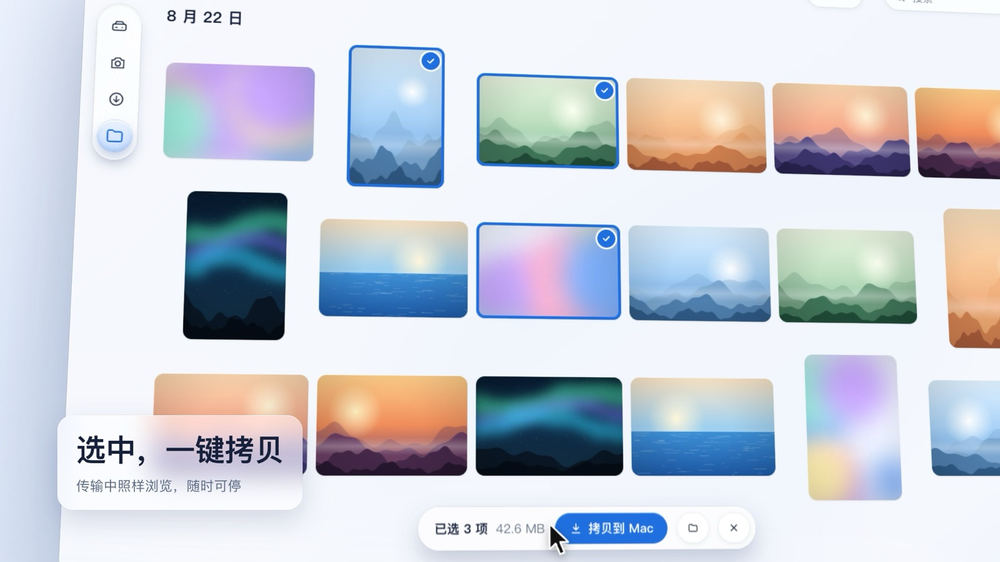
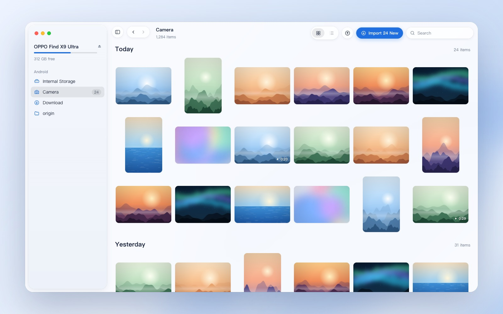
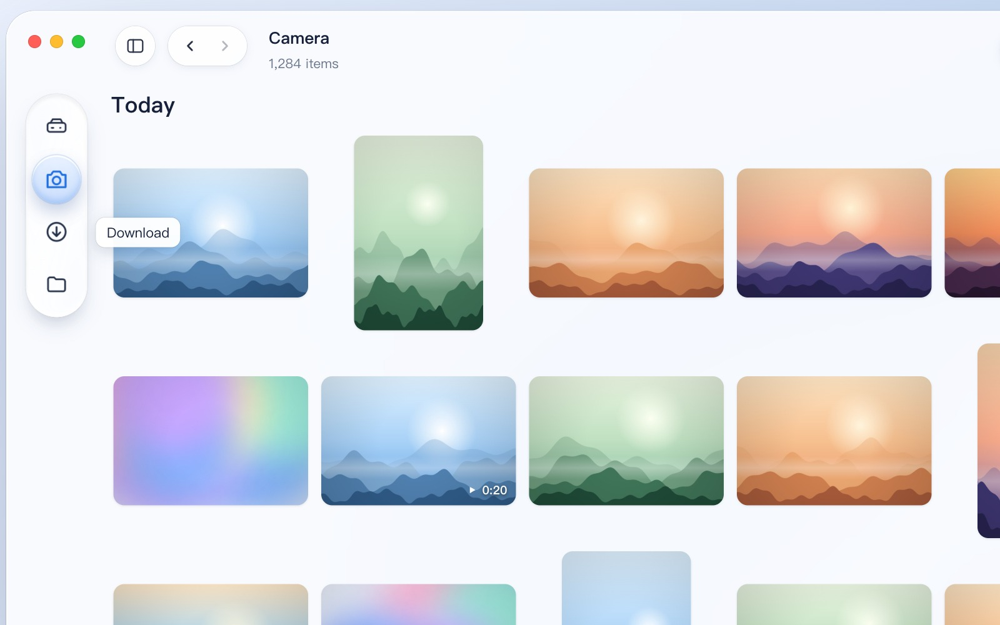
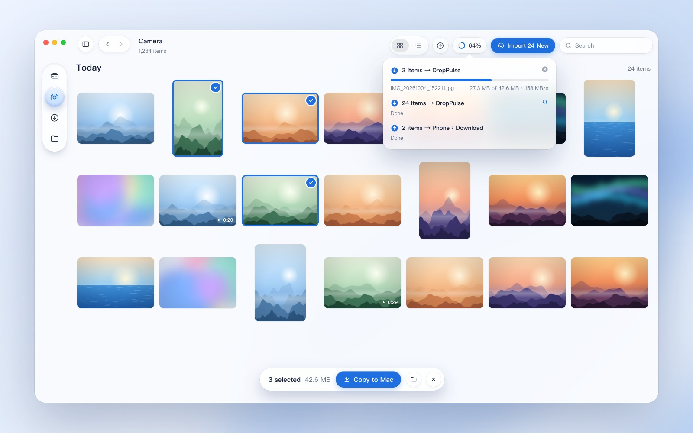
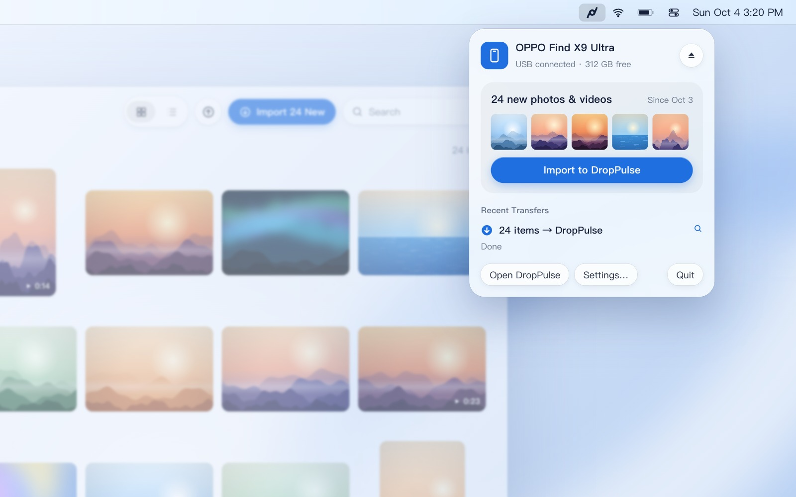
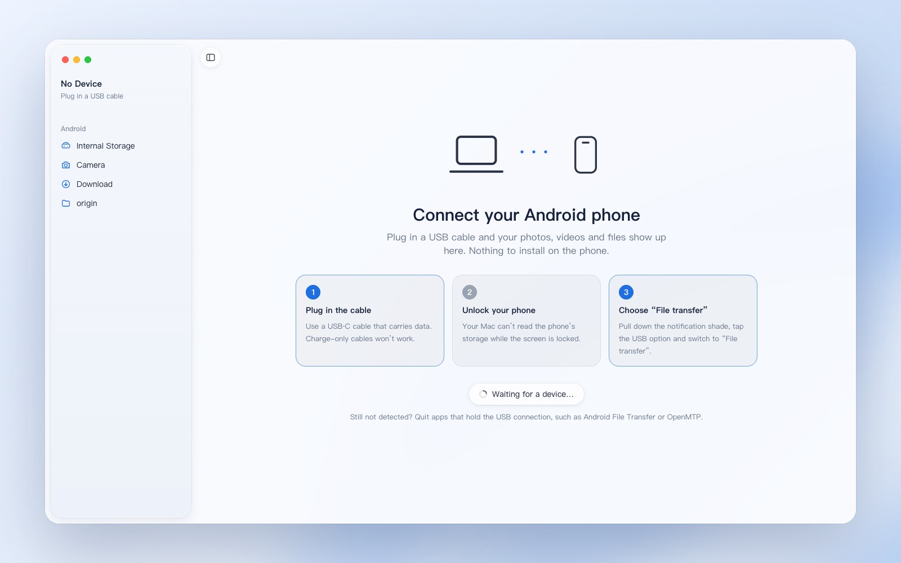

# DropPulse

English · [简体中文](README.zh-CN.md)

**Android ↔ Mac file transfer in a pulse.** DropPulse is a native macOS app for moving photos, videos and files between an Android phone and a Mac over USB. Plug the phone in, see your photos instantly, drag them out.

It is built with SwiftUI and Liquid Glass, on a small MTP implementation written directly against Apple's IOUSBHost framework: no third-party libraries, no kernel extensions, nothing to install on the phone.



A short look at it in motion:

https://github.com/user-attachments/assets/a1d7efc4-90fa-41ac-95b4-419197af3e58

## Fast

- **Folders open in a blink.** A whole folder is read in one MTP request (`GetObjectPropList`): 1,956 camera items in 0.4 s.
- **Thumbnails in milliseconds.** DropPulse reads only the first 128 KB of each photo to get the JPEG thumbnail the camera embeds in its Exif block, about 2 ms each. HEIC files from cameras such as Hasselblad use their HEIF preview item, JPEG files fall back to MTP `GetThumb`, and videos read just their index and first frame.
- **Up to 160 MB/s.** Transfers are chunked and can be stopped at any time, and browsing keeps working while they run.
- **Videos play while they stream.** Nothing is copied first.

## Effortless

- **Opens when you plug in.** DropPulse waits in the menu bar after login and opens its window when a phone connects. It also takes the phone back from macOS's `ptpcamerad`, which otherwise claims MTP devices.
- **Safe copies.** Nothing on the Mac is ever overwritten: identical files are skipped and others get Finder-style names (`IMG 2.jpg`).
- **Grouped by when photos were taken.** Dates come from camera file names, or from Exif `DateTimeOriginal` read in the background and cached.
- **Import new photos in one click** from the toolbar, the menu bar panel, or ⇧⌘I.
- **A Liquid Glass sidebar.** It folds into a floating glass island whose selection lens stretches and springs between folders.

## A closer look

**Browse by the day photos were taken.** The sidebar shows the phone, its free space and your folders.



**Fold the sidebar into a glass island.** One button cycles between the full sidebar, icons only and hidden.



**Keep browsing while files copy.** Pick photos, copy them, and follow every transfer from the toolbar.



**One click away in the menu bar.** See what is new since your last import, import it in one click, and check recent transfers.



**A short guide while no phone is connected.** DropPulse picks the phone up the moment it appears.



## Requirements

- macOS 26 or later on Apple silicon
- An unlocked Android phone in **File transfer** mode

## Build

Only the Command Line Tools are needed, not Xcode:

```bash
./build.sh
open build/DropPulse.app
```

Copy `build/DropPulse.app` to `/Applications` to have it start at login. It only registers itself as a login item from there.

## How it works

| File | What it does |
| --- | --- |
| `MTP.swift` | A small MTP initiator on IOUSBHost: session recovery, folder listings, ranged reads, chunked downloads, streamed uploads, rename and delete. It runs on its own serial queue, so blocking USB I/O never stalls Swift's thread pool. |
| `Thumbs.swift` | Thumbnails from Exif, HEIF previews and `GetThumb`, video frames, and an `AVAssetResourceLoader` that streams video over ranged reads. |
| `Store.swift` | App state: connection, browsing, capture dates, the transfer queue and file operations. |
| `Browser.swift` | The photo grid and list, the floating selection bar, drag and drop, and the video player. |
| `Sidebar.swift` | The window root, the sidebar and its glass island, and dialogs. |
| `Panels.swift` | The connect guide, transfer progress and the menu bar panel. |
| `DropPulseApp.swift` | Scenes, menu commands, settings and the login item. |

The app icon and the menu bar icon are drawn as vectors by `scripts/make-icon.swift`.

## Notes

- Tested with an OPPO Find X9 Ultra running ColorOS. Other Android phones speak the same MTP dialect, and reports are welcome.
- Only one app can use a phone over MTP at a time. Quit Android File Transfer or OpenMTP while DropPulse is connected.

## Credits

Inspired by [OpenMTP](https://github.com/ganeshrvel/openmtp) by Ganesh Rathinavel; the first prototype used its Kalam kernel, and the current code contains none of it. Design references: "Liquid glass" by Andrii Vynarchyk on Dribbble and "Glass Button UI" by Rishabh Rai on Webflow.

## License

[MIT](LICENSE)
