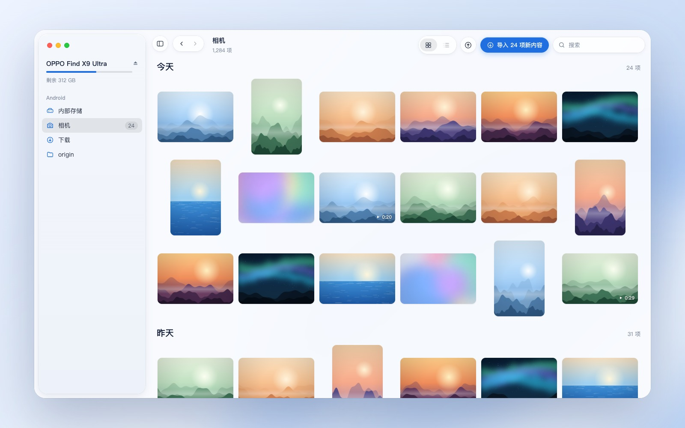
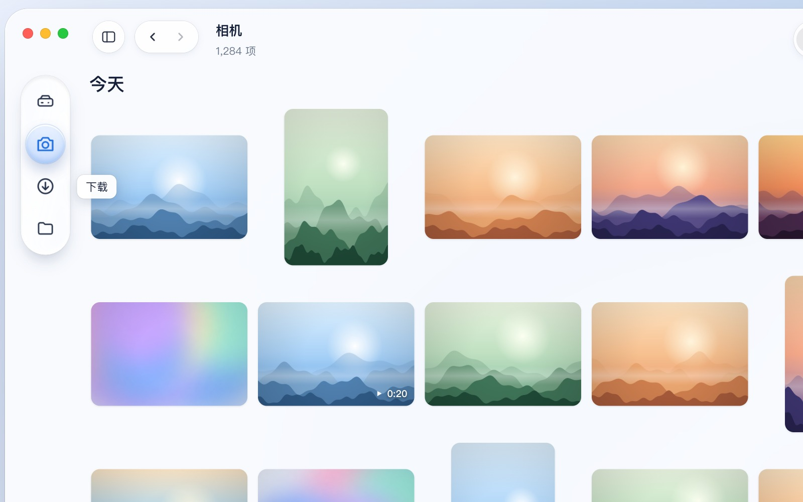
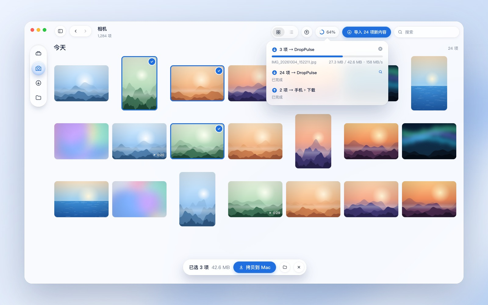
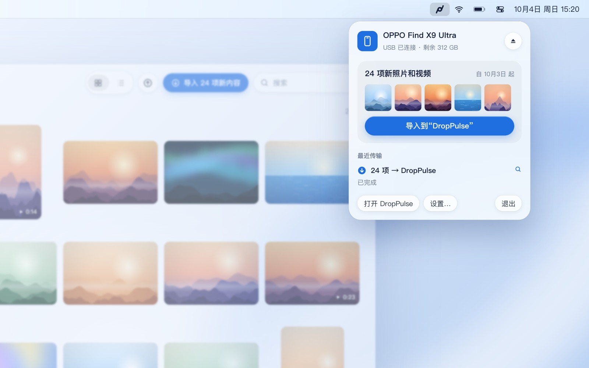
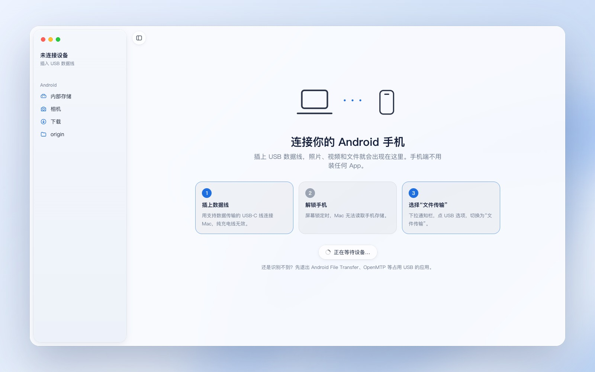

# DropPulse

[English](README.md) · 简体中文

**Android 与 Mac 之间，一瞬即达。** DropPulse 是一款原生 macOS 应用，通过 USB 在 Android 手机和 Mac 之间传送照片、视频和文件。插上手机，照片立刻出现，拖出来就完成了。

界面用 SwiftUI 和 Liquid Glass 构建；MTP 通信直接基于 Apple 的 IOUSBHost 框架实现：不依赖第三方库，不需要内核扩展，手机端也不用安装任何东西。


15 秒演示视频：

https://github.com/user-attachments/assets/82748ee1-8aa9-4e15-bb22-702e56645a01

## 快

- **文件夹秒开**：一次 MTP 请求（`GetObjectPropList`）读完整个文件夹，相机里 1,956 个项目只需 0.4 秒。
- **缩略图毫秒级**：每张照片只读取开头 128 KB，取出相机写在 Exif 里的 JPEG 小图，每张约 2 毫秒。哈苏等相机拍的 HEIC 会改用文件内的 HEIF 预览图；JPEG 会退而使用 MTP `GetThumb`；视频只读取索引和第一帧。
- **最高 160 MB/s**：传输分块进行，随时可以停止，传输期间照常浏览。
- **视频边读边播**：不用先拷贝到 Mac。

## 省心

- **插上就打开**：登录后在菜单栏待命，手机一连上就自动打开窗口。macOS 自带的 `ptpcamerad` 会抢占 MTP 设备，DropPulse 会自动把手机接管回来。
- **拷贝不覆盖**：绝不覆盖 Mac 上已有的文件。名称和大小都相同的直接跳过，其余按访达的方式自动改名（`IMG 2.jpg`）。
- **按拍摄日期分组**：拍摄时间优先从相机文件名读取；文件名里没有时间的，在后台读取 Exif 里的 `DateTimeOriginal` 并缓存。
- **一键导入新照片**：工具栏、菜单栏面板或快捷键 ⇧⌘I 都可以触发。
- **Liquid Glass 边栏**：可以收成一座悬浮的玻璃浮岛，切换文件夹时，选中透镜会先拉伸、再回弹到位。

## 界面一览

**按拍摄日期浏览。** 边栏显示手机型号、剩余空间和常用文件夹。



**边栏收成玻璃浮岛。** 同一个按钮在完整边栏、仅图标和隐藏之间切换。



**拷贝时照常浏览。** 选中照片一键拷贝，工具栏里随时查看每一项传输。



**菜单栏一点即达。** 查看上次导入后的新照片，一键导入，顺便看看最近的传输。



**没连手机时，有简短的连接引导。** 手机一接上，DropPulse 立刻识别。



## 系统要求

- Apple 芯片，macOS 26 或更高版本
- 已解锁、USB 模式设为"文件传输"的 Android 手机

## 构建

只需要命令行工具（Command Line Tools），不需要 Xcode：

```bash
./build.sh
open build/DropPulse.app
```

把 `build/DropPulse.app` 拷贝到"应用程序"文件夹后，它才会注册为登录项，开机自动在菜单栏待命。

## 实现方式

| 文件 | 作用 |
| --- | --- |
| `MTP.swift` | 基于 IOUSBHost 的精简 MTP 实现：会话恢复、读取文件夹、按范围读取、分块下载、流式上传、重命名和删除。它运行在独立的串行队列上，阻塞的 USB 读写不会卡住 Swift 的线程池。 |
| `Thumbs.swift` | 从 Exif、HEIF 预览图和 `GetThumb` 生成缩略图，生成视频首帧，以及基于按范围读取的视频流式播放。 |
| `Store.swift` | 应用状态：连接、浏览、拍摄日期、传输队列和文件操作。 |
| `Browser.swift` | 照片网格与列表、悬浮选择栏、拖放、视频播放器。 |
| `Sidebar.swift` | 窗口根视图、边栏及玻璃浮岛、对话框。 |
| `Panels.swift` | 连接引导页、传输进度、菜单栏面板。 |
| `DropPulseApp.swift` | 场景、菜单命令、设置和登录项。 |

应用图标和菜单栏图标都由 `scripts/make-icon.swift` 以矢量方式绘制。

## 说明

- 测试机型为 OPPO Find X9 Ultra（ColorOS）。其他 Android 手机使用相同的 MTP 协议，欢迎反馈使用情况。
- 同一时间只能有一个应用通过 MTP 使用手机。DropPulse 连接期间，请退出 Android File Transfer 或 OpenMTP。

## 致谢

灵感来自 Ganesh Rathinavel 的 [OpenMTP](https://github.com/ganeshrvel/openmtp)。最初的原型使用过它的 Kalam 内核，现在的代码已不包含其任何部分。设计参考：Dribbble 上 Andrii Vynarchyk 的"Liquid glass"，以及 Webflow 上 Rishabh Rai 的"Glass Button UI"。

## 许可证

[MIT](LICENSE)
